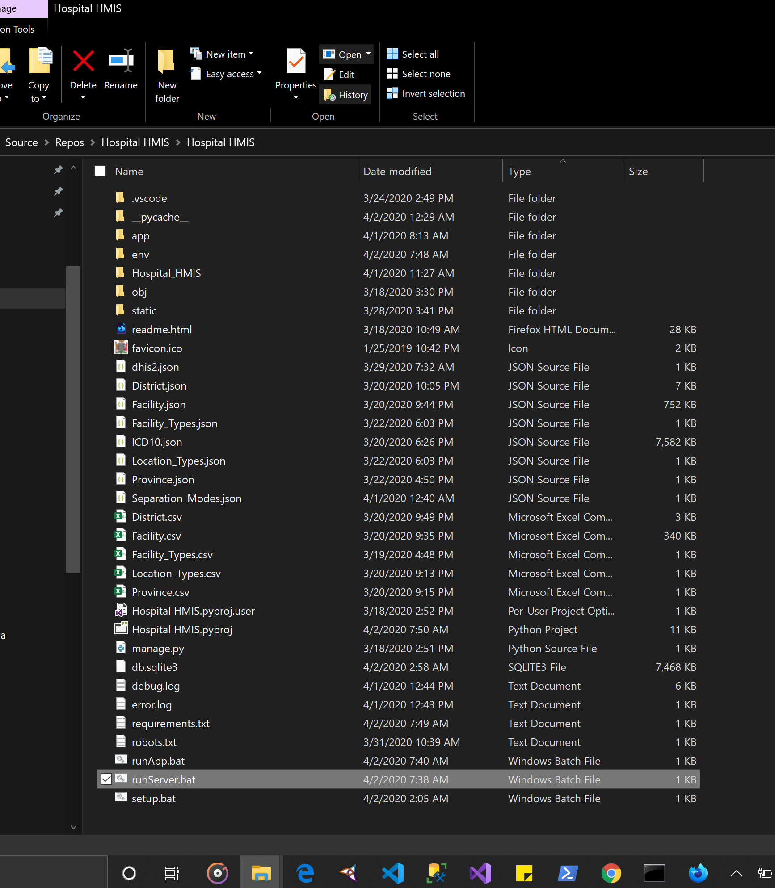
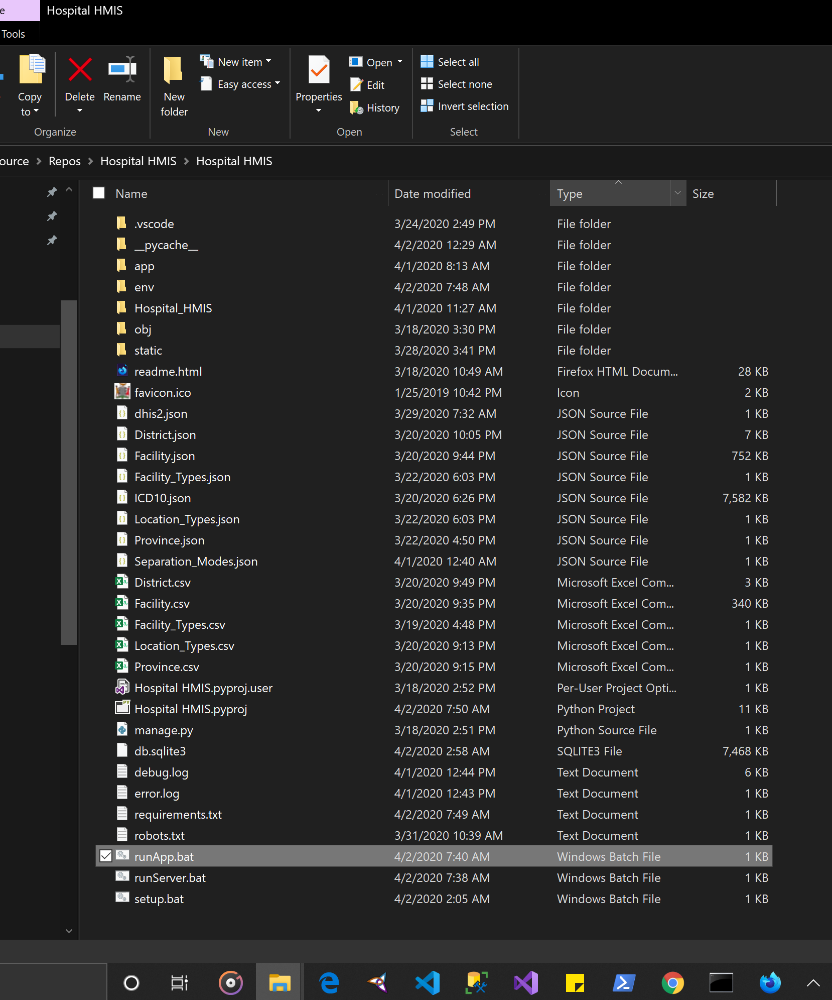

# Hospital-HMIS


## How run the tool
```
Step 1: Download python from https://www.python.org/ftp/python/3.7.7/python-3.7.7.exe 
```

```
Step 2: Download the tool from [https://github.com/MOH-Zambia/Hospital-HMIS/releases] 
```

```bash
Step 2: Unzip folder anywhere on your computer
```

```bash
Step 3: Double-click on runServer.bat to the server 
```


```bash
Step 4: Double-click on runApp to run the application 
```

